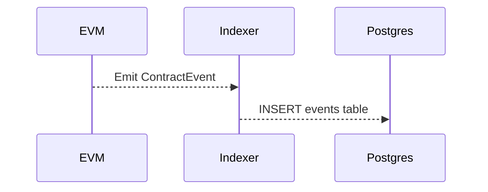

# ADR-002 Event Sourcing

We decided to mirror key EVM events to Postgres so that the backend can query historical data without relying on a node archive.

## Pros
- Simple queries via SQL
- Avoids the cost of historical RPC calls

## Cons
- Extra storage requirements
- Indexer service adds operational overhead
