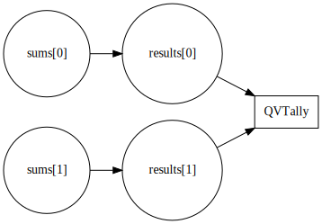

# C-13 E2E Circuit Documentation

This guide describes the end-to-end circuit architecture. It includes
constraint graphs generated from the Circom sources, an overview of the
witness inputs and the Groth16 trusted setup steps.

## Constraint Graph

The `circomgraph` tool can export a visual representation of each R1CS
file. After compiling the circuits run:

```bash
npx -y circom2 circuits/qv/qv_tally.circom --r1cs
npx -y circomgraph artifacts/qv_tally/qv_tally.r1cs -o docs/assets/qv_tally.svg
```

The resulting SVG can be referenced directly in the docs:



## Circuit Inputs

The `QVTally` example circuit accepts vote sums and their square roots.
The prover supplies both arrays as private inputs and receives a single
public output confirming all checks passed.

| Signal | Description |
| ------ | ----------- |
| `sums[0..n]` | Vote totals for each option |
| `results[0..n]` | Square roots proving validity of the sums |
| `ok` | Output flag set to `1` when constraints are satisfied |

## Trusted Setup Workflow

The repository uses Groth16 proving. The high level process is:

1. Compile all circuits to R1CS and WASM using `npx -y circom2`.
2. Generate a Powers of Tau ceremony:
   ```bash
   snarkjs powersoftau new bn128 14 pot14_0000.ptau
   snarkjs powersoftau contribute pot14_0000.ptau pot14_0001.ptau --name "first"
   snarkjs powersoftau prepare phase2 pot14_0001.ptau pot14_final.ptau
   ```
3. Produce the initial zkey for each circuit:
   ```bash
   snarkjs groth16 setup artifacts/qv_tally/qv_tally.r1cs pot14_final.ptau artifacts/qv_tally/zkey_0.zkey
   ```
4. Contribute additional randomness with `snarkjs zkey contribute` and
   verify the final zkey.
5. Export Solidity verifiers and store all artifacts under `artifacts/`.

## Publishing with MkDocs

MkDocs builds the documentation site via `mkdocs build`. During CI the
site is published to GitHub Pages from the `gh-pages` branch. Run
`mkdocs serve` locally to preview the pages.
